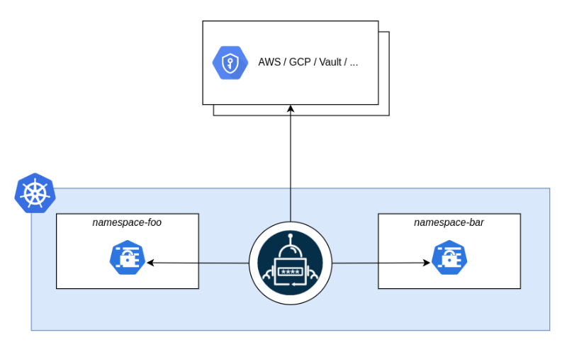

# manage-secrets-k8s

# Research 
One of our clients is running Kubernetes on AWS (EKS + Terraform). At the moment, they store secrets like database passwords in a configuration file of the application, which is stored along with the code in Github. The resulting application pod is getting an ENV variable with the name of the environment, like staging or production, and the configuration file loads the relevant secrets for that environment.

We would like to help them improve the way they work with this kind of sensitive data.

Please also note that they have a small team and their capacity for self-hosted solutions is limited.

Provide one or two options for how would you propose them to change how they save and manage their secrets.

# Solution 
We can store our DB passwords in AWS Parameter Store or Secrets Manager.

How can we retrieve passwords for these external services? We can use an "External Secrets Operator" for retrieving the secrets from AWS managed secrets store and injecting them into the pod as an environment variable.

# External Secrets Operator
External Secrets Operator reads information from a third-party service like AWS Secrets Manager and automatically injects the values as Kubernetes Secrets. 



External Secrets Operator is a Kubernetes operator that integrates external secret management systems like AWS Secrets Manager, HashiCorp Vault, Google Secrets Manager, Azure Key Vault, IBM Cloud Secrets Manager, and many more. The operator reads information from external APIs and automatically injects the values into a Kubernetes Secret.

# What is the goal of External Secrets Operator?
The goal of External Secrets Operator is to synchronize secrets from external APIs into Kubernetes. ESO is a collection of custom API resources - ExternalSecret, SecretStore and ClusterSecretStore that provide a user-friendly abstraction for the external API that stores and manages the lifecycle of the secrets for you.


https://external-secrets.io/v0.8.1/

https://external-secrets.io/

https://github.com/external-secrets/external-secrets/

# Install External Secrets using Helm:

```
helm repo add external-secrets https://charts.external-secrets.io/
```

```
helm repo update external-secrets
```

```
helm search repo external-secrets/external-secrets
```

```
helm upgrade --install external-secrets external-secrets/external-secrets --version 0.8.1 -n external-secrets --create-namespace
```

# Created 
AWS Secrets Manager

- Secret key: db_password
- Secret value: DemoPasswordFromSecretManager

AWS Parameter Store and 

- Name: /demo/db_password
- Value: DemoPasswordFromParameterStore


# Deploy demo  External Secrets to EKS clusters.
Create ServiceAccount with "IRSA" role.
```
 kubectl apply -f serviceaccount.yaml
```

The "ClusterSecretStore" is a cluster scoped SecretStore that can be referenced by all ExternalSecrets from all namespaces. Use it to offer a central gateway to your secret backend

Deploy "ClusterSecretStore" with AWS Secrets Manager Provider. 

```
 kubectl apply -f css-secrets-manager.yaml
```
Deploy "ClusterSecretStore" with AWS Parameter Store Provider. 
```
 kubectl apply -f css-parameter-store.yaml
```

Deploy "ExternalSecret". 
```
 kubectl apply -f external-secret.yaml
```

# Deploy mysql to the EKS cluster and get "MYSQL_ROOT_PASSWORD" from ExternalSecret.
```
 kubectl apply -f deployment.yaml
```