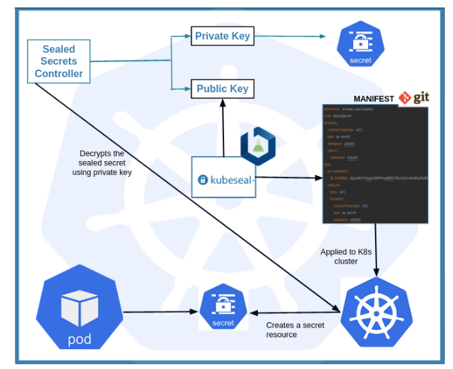

# manage-secrets-k8s
# Sealed Secrets
# Research 
One of our clients is running Kubernetes on AWS (EKS + Terraform). At the moment, they store secrets like database passwords in a configuration file of the application, which is stored along with the code in Github. The resulting application pod is getting an ENV variable with the name of the environment, like staging or production, and the configuration file loads the relevant secrets for that environment.

We would like to help them improve the way they work with this kind of sensitive data.

Please also note that they have a small team and their capacity for self-hosted solutions is limited.

Provide one or two options for how would you propose them to change how they save and manage their secrets.

# Solution 

Encrypt your Secret into a SealedSecret, which is safe to store — even to a public repository. The SealedSecret can be decrypted only by the controller running in the target cluster and nobody else (not even the original author) is able to obtain the original Secret from the SealedSecret.

There are two-component in sealed secret.

1. Client CLI => Used to generate encrypted secrets. No one decrypts except the secret controller.

2. Kubernetes Secret controller => Used to decrypt the sealed secret and store it as secret in the Kubernetes Cluster.


# This chart bootstraps a Sealed Secret Controller Deployment in Kubernetes using the Helm package manager.
```
helm repo add sealed-secrets https://bitnami-labs.github.io/sealed-secrets
helm install sealed-secrets -n kube-system --set-string fullnameOverride=sealed-secrets-controller sealed-secrets/sealed-secrets
```
When the installation has been completed controller creates two keys on its own.

The private key which use to decrypt the secrets. This should stay within the cluster and never should share with anyone.
The public key which used for the encryption of secrets. This can be used outside of the cluster or shared with someone.

# Encrypting your secrets
```
wget https://github.com/bitnami-labs/sealed-secrets/releases/download/v0.20.2/kubeseal-0.20.2-linux-amd64.tar.gz
tar -xvf kubeseal-0.20.2-linux-amd64.tar.gz 
sudo install -m 755 kubeseal /usr/local/bin/kubeseal
```

# Apply the sealed secret
```
kubectl create ns sealed-demo

echo "DemoSecret" | base64
RGVtb1NlY3JldAo=
```
$ cat secret.yaml 
```
apiVersion: v1
kind: Secret
metadata:
  name: sealed-secret
  namespace: sealed-demo
data:
  DB_PASSWORD: RGVtb1NlY3JldAo=
```
# Create Sealed Secret via kubeseal
```
cat secret.yaml | kubeseal \
      --controller-name=sealed-secrets-controller \
      --controller-namespace=kube-system \
      --format yaml sealed-secret.yaml \
      > sealed-secret.yaml
```
```
kubectl apply -f sealed-secret.yaml
```

# Conclusion
Store your sensitive data in a Kubernetes Secret object is a common practice, but don’t forget that a Secret is only encoded and not encrypted. So if you want to store them in a Git Repository , you’ll need to find a secure solution. Sealed Secret helps you to see that it can be a solution that you can try in your side.